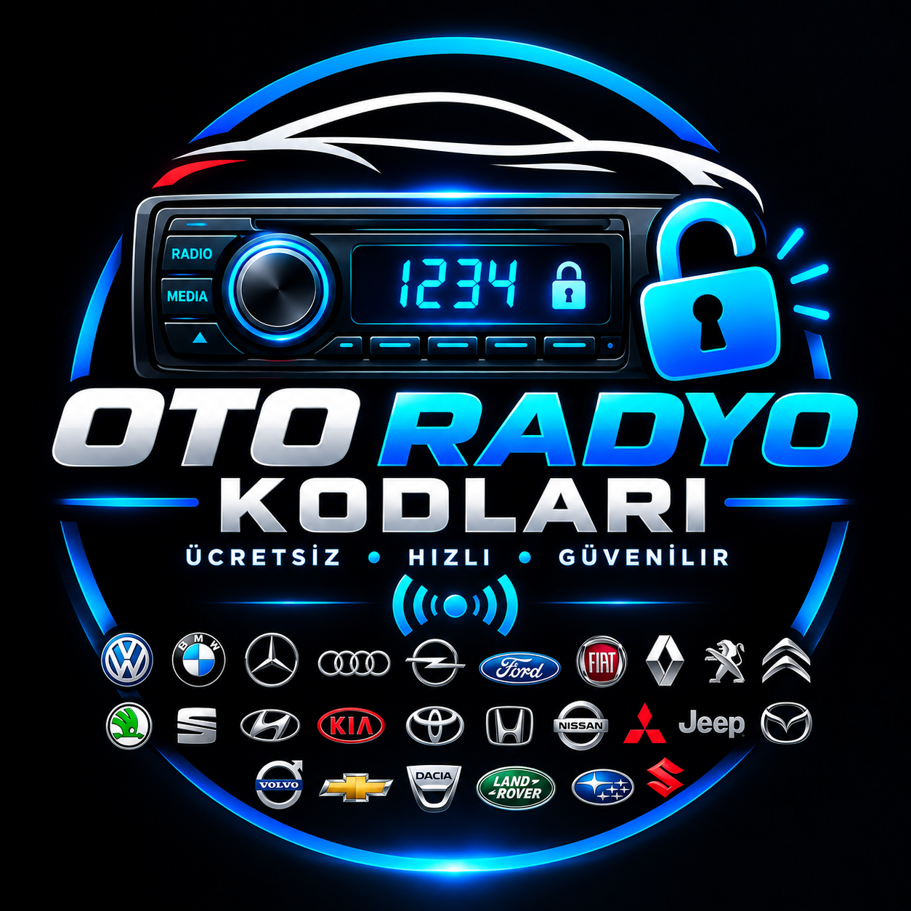

<div align="center">

  <!-- PROJE LOGOSU -->
  

  # 🚗 Oto Radyo Kodları & Şifre Çözüm Merkezi

  **Ücretsiz • Hızlı • Güvenilir**

  [](https://github.com/kullanici-adiniz/repo-adiniz)
  [](LICENSE)
  [](https://github.com)

  Tüm otomobil markalarının fabrika çıkışlı oto teyp ve radyo açılış kodlarını seri numarası veya EEPROM / MCU döküm (dump) dosyaları üzerinden anında sorgulama ve çözme platformu.

</div>

---

## ⚡ Öne Çıkan Özellikler

- **🔥 1.300.000+ Hazır Veritabanı Kodu:** Volkswagen, Ford, Fiat, Renault, Dacia, Opel, Becker, Chrysler, Clarion ve daha fazla marka için devasa kod arşivi.
- **🔬 EEPROM & MCU Çip Döküm Servisi:** Seri numarası silinmiş veya veritabanında bulunmayan teypler için `24C64`, `95320`, `FIS dumps`, `HC11` vb. çip okuma desteği.
- **🖥️ Kod Hesaplama Programları Arşivi:** Teyp markalarına özel `.exe` ve hesaplama yazılımlarının tam listesi.
- **🎯 Akıllı Karakter ve Hata Denetimi:** Girilen seri numarası uzunluğunu modele göre otomatik doğrulayan akıllı uyarı sistemi.
- **📻 Teybe Kod Girme Rehberleri:** Her modelin tuş yapısına ve ekranına uygun adım adım kod girme talimatları.
- **📱 Canlı Destek Entegrasyonu:** Özel durumlar ve teknisyenler için doğrudan WhatsApp canlı sorgulama altyapısı.
- **🛡️ Gelişmiş İçerik Koruması:** Sağ tık, DevTools, kaynak kod kopyalama ve resim sürükleme korumalı güvenli mimari.
- **📱 Tam Mobil (Responsive) Uyumluluk:** Cep telefonu, tablet ve masaüstü cihazlarda kusursuz çalışan kullanıcı dostu arayüz.

---

## 🚘 Desteklenen Bazı Marka ve Teyp Sistemleri

| Marka / Sistem | Desteklenen Teyp & Seri Modelleri |
| :--- | :--- |
| **Volkswagen (VW)** | RCD 210, RCD 310, RCD 510, MFD2, Delta 6, Gamma (VWZ...) |
| **Ford** | 6000 CD, Sony CD, TravelPilot (M ve V Serisi) |
| **Fiat & Alfa Romeo** | Daiichi, Visteon, VP1 / VP2, Uconnect |
| **Renault & Dacia** | Tuner List, Update List, Precode Sistemleri |
| **Opel** | CDR 500, CDR 2005, Delco GM, Vivaro / Movano |
| **Becker** | Traffic Pro, Monza, Mexico, 4/6/8-Button & Presets |
| **Chrysler & Jeep** | Alpine AA, Becker T00BE, Preset 5/6, TM9 |
| **Diğer Markalar** | Clarion C7 (Citroen/Peugeot), Delphi/Famar, Alpine/Jaguar |

---

## 📂 Proje Dosya Yapısı

```text
├── index.html              # Tüm platformu bağlayan ana sayfa
├── logo.png                # Platform logosu ve açılış görseli
├── d.py                    # HTML ve JSON veritabanlarını oluşturan betik
├── volkswagen.html         # VW grubu radyo kod çözücü
├── ford_m.html             # Ford M serisi kod çözücü
├── ford_v.html             # Ford V serisi kod çözücü
├── renault.html            # Renault precode çözücü
├── dacia.html              # Dacia precode çözücü
├── fiat_daiichi.html       # Fiat Daiichi kod çözücü
├── becker_4digit.html      # Becker 4-digit kod çözücü
└── ... (34+ Marka HTML Sayfası ve JSON Veritabanı Dosyaları)
